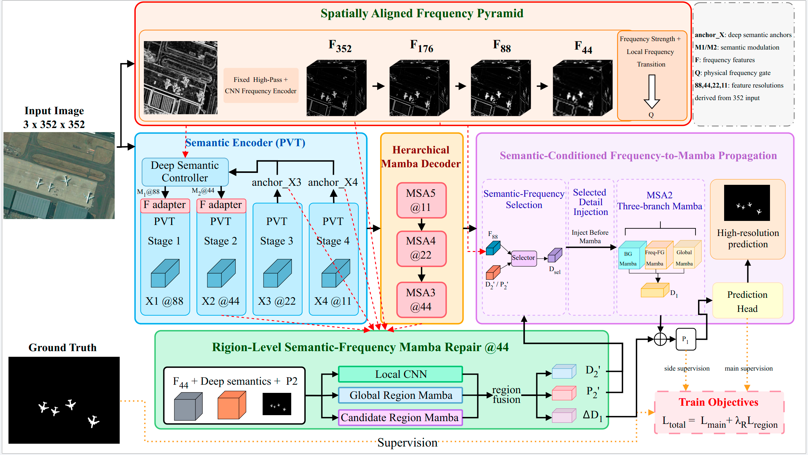

# SFP-Mamba

Official implementation of **SFP-Mamba: Semantic-Frequency Propagation and Region-Level Repair for Salient Object Detection in Optical Remote Sensing Images**.

SFP-Mamba is designed for salient object detection (SOD) in optical remote sensing images. The framework progressively introduces spatially aligned frequency modeling, semantic-conditioned frequency propagation, and region-level residual repair to improve structural representation and foreground-background discrimination.

## Repository Structure

The released package is organized as follows:

```text
SFP-Mamba/
├── README.md
├── code/
│   ├── train_eorssd.py
│   ├── test_eorssd.py
│   ├── train_orssd.py
│   ├── test_orssd.py
│   ├── data.py
│   │
│   ├── model/
│   │   ├── MyNet_SF.py
│   │   ├── SF_backbone.py
│   │   ├── SF_VMmamba_decoder.py
│   │   ├── SF_modules.py
│   │   ├── VMmamba_decoder.py
│   │   ├── Groupmamba_decoder.py
│   │   └── pvtv2.py
│   │
│   ├── losses/
│   │   ├── __init__.py
│   │   └── sf_sod_loss.py
│   │
│   ├── utils/
│   │   └── utils.py
│   │
│   ├── pretrain/
│   │   └── pvt_v2_b2.pth
│   │
│   ├── checkpoints/
│   │   └── best_eorssd.pth
│   │   └── best_orssd.pth
│   │
│   ├── outputs/
│   └── results/
├── figs/
│   └── ...
└── feature_map/
    └── ...
```

- `code/` contains the model implementation, training code, evaluation code, losses, and utility functions.
- `feature_map/` contains prediction maps and experimental visualization results used in our analysis.
- `README.md` provides instructions for environment setup, model weights, training, and evaluation.

## Network Architecture

<p align="center">
  
</p>

<p align="center">
  <b>Figure 1.</b> Overall architecture of SFP-Mamba.
</p>


## Requirements

The code is implemented in Python and PyTorch. A CUDA-enabled GPU is required for training and evaluation.

Main dependencies include:

```text
Python
PyTorch
torchvision
numpy
Pillow
tensorboard
pysodmetrics
```

Install the required packages in your environment before running the code. For example:

```bash
pip install numpy pillow tensorboard pysodmetrics
```

Please install a PyTorch version compatible with your CUDA environment separately.

## Pretrained Weights and Checkpoints

The pretrained PVTv2-B2 backbone and released SFP-Mamba checkpoints can be downloaded from Baidu Netdisk:

**Baidu Netdisk:**  
https://pan.baidu.com/s/1R4k7k0bhhSz8DlNqczUcXw?pwd=51ac

**Extraction code:** `51ac`

After downloading, place the files under the corresponding directories in `code/`.

Recommended layout:

```text
code/
├── pretrain/
│   └── pvt_v2_b2.pth
└── checkpoints/
    └── sfp_mamba_eorssd.pth
```

The ImageNet-pretrained PVTv2-B2 checkpoint is required when reproducing training from the released training script. The final SFP-Mamba checkpoint is sufficient for evaluation.

## Dataset Preparation

The current scripts are configured for the author's local dataset paths. They can be changed either directly in the scripts or through command-line arguments.

### EORSSD

Default training paths:

```text
/home/lch/work/sod/dataset/EORSSD/train-images
/home/lch/work/sod/dataset/EORSSD/train-labels
```

Default test paths:

```text
/home/lch/work/sod/dataset/EORSSD/test-images
/home/lch/work/sod/dataset/EORSSD/test-labels
```

A typical dataset organization is:

```text
EORSSD/
├── train-images/
├── train-labels/
├── test-images/
└── test-labels/
```

## Training

Enter the source-code directory first:

```bash
cd SFP-Mamba/code
```

The released EORSSD training script follows the progressive training schedule used in the paper.

```text
E001-E010   Base representation
E011-E033   + Frequency Modeling
E034-E060   + Semantic-Conditioned Propagation
E061-E100   + Region-Level Repair and joint refinement
```

The complete optimization contains **100 epochs**, divided into `10 + 23 + 27 + 40` epochs.

Training uses a fixed input resolution of `352 x 352`. For EORSSD, six geometric training views are used:

```text
identity
rot90
rot180
rot270
hflip
hflip + rot180
```

The effective batch size is 16 through gradient accumulation.

Run training with:

```bash
CUDA_VISIBLE_DEVICES=0 python train_eorssd.py
```

To explicitly specify the pretrained PVTv2-B2 checkpoint:

```bash
CUDA_VISIBLE_DEVICES=0 python train_eorssd.py \
    --pretrain pretrain/pvt_v2_b2.pth
```

To override the default dataset paths:

```bash
CUDA_VISIBLE_DEVICES=0 python train_eorssd.py \
    --train_image_root /path/to/EORSSD/train-images \
    --train_gt_root /path/to/EORSSD/train-labels
```

At the transition from epoch 60 to epoch 61, the EMA model obtained after the region-free stage is used as both the initialization of the final-stage student and the frozen teacher for region-level supervision. The teacher uses the same SFP-Mamba architecture as the student but keeps region-level repair disabled and remains frozen during the final training stage.

The final EMA checkpoint is saved as:

```text
code/checkpoints/sfp_mamba_eorssd.pth
```

Intermediate training outputs are saved under:

```text
code/outputs/eorssd_100e/
```

## Evaluation

The released results use **single-view inference without test-time augmentation**.

Run:

```bash
cd SFP-Mamba/code

CUDA_VISIBLE_DEVICES=0 python test_eorssd.py
```

By default, the script loads:

```text
checkpoints/sfp_mamba_eorssd.pth
```

To evaluate another checkpoint:

```bash
CUDA_VISIBLE_DEVICES=0 python test_eorssd.py \
    --checkpoint /path/to/checkpoint.pth
```

To override the test dataset paths:

```bash
CUDA_VISIBLE_DEVICES=0 python test_eorssd.py \
    --image_root /path/to/EORSSD/test-images \
    --gt_root /path/to/EORSSD/test-labels
```

## Evaluation Protocol

The released evaluation code follows the same protocol used for the reported SFP-Mamba results:

1. Resize the network input to `352 x 352`.
2. Keep the ground-truth mask at its original spatial resolution.
3. Use the final prediction logit from the network.
4. Resize the **logit** to the original ground-truth resolution using bilinear interpolation with `align_corners=False`.
5. Apply sigmoid activation.
6. Apply per-image min-max normalization.
7. Convert the prediction to `uint8`.
8. Compute SOD metrics with `py_sod_metrics`.

The evaluation script reports:

```text
MAE
S_alpha
F_beta_mean
F_beta_adp
F_beta_max
E_xi_mean
E_xi_adp
E_xi_max
weighted_F
```

The exact prediction maps used for metric computation are also saved as PNG files.

Default output directory:

```text
code/results/EORSSD/
```

including:

```text
results/EORSSD/
├── predictions_png/
├── prediction_manifest.csv
├── metrics.csv
└── metrics.json
```

## Feature Maps and Prediction Results

The `feature_map/` directory contains experimental prediction maps and visualization results produced during our experiments.

```text
SFP-Mamba/
└── feature_map/
    └── ...
```

These files are provided for qualitative comparison and visualization. They are not required for training or inference.

## Notes

- Training and evaluation for ORSSD and EORSSD are performed independently.
- The released evaluation uses single-view inference only.
- No rotation-based test-time augmentation is required for the reported SFP-Mamba results.
- The pretrained PVTv2-B2 weights are only required when reproducing training from ImageNet initialization.
- When evaluating a released full checkpoint, construct the network without loading the PVT pretrained weights and then load the complete SFP-Mamba checkpoint.
- For strict experimental reproduction, do not use the official test set for checkpoint selection during training.

## Citation

If this code is useful for your research, please cite our paper:

```bibtex
@article{sfp_mamba,
  title   = {SFP-Mamba: Semantic-Frequency Propagation and Region-Level Repair for Salient Object Detection in Optical Remote Sensing Images},
  author  = {Anonymous},
  journal = {TBD},
  year    = {TBD}
}
```

Please replace the placeholder bibliographic information above with the final publication information after acceptance.

## Acknowledgements

This implementation builds on PyTorch and uses PVTv2-B2 as the semantic backbone. We thank the authors of the related open-source projects and evaluation tools used in this work.
